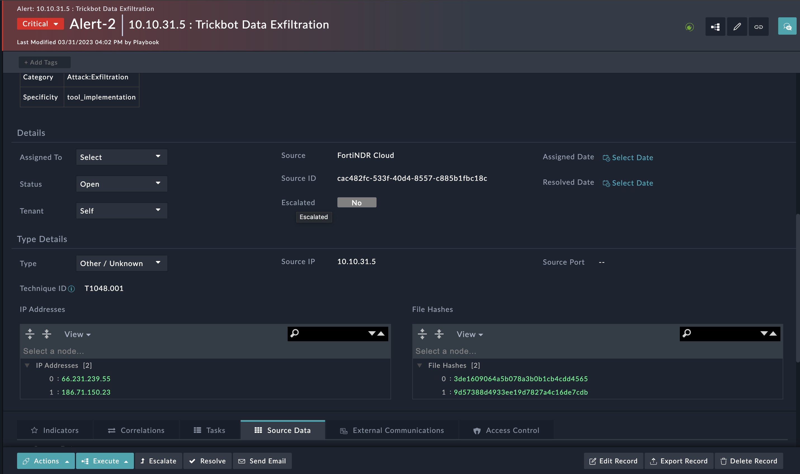

| [Home](../README.md) |
|----------------------|
# Usage

Refer to [Simulate Scenario documentation](https://github.com/fortinet-fortisoar/solution-pack-soc-simulator/blob/develop/docs/usage.md) to understand how to simulate and reset scenarios.

To understand the process FortiSOAR follows to respond to alerts related to data exfiltration detected by FortiNDR Cloud, we have included a scenario &mdash; **FortiNDR Detections** with this solution pack.

## FortiNDR Detections

This scenario generates an example alert related to Data Exfiltration in FortiSOAR's **Alerts** module.

Navigate to demo alert and note the following:

- The demo alert created is an example of a FortiNDR Cloud detecting a Data Exfiltration on the asset

- The reported alert contains the following information:

    - Specificity 

    - Status

    - Category

    - Confidence

    - Next steps

- The playbook `Fortinet FortiNDR Cloud > Fetch Detection Events` runs manually and performs the following actions.

    - Fetch events for specified detection and append the same to the source data in the alert.

    - Creates a record for the asset on which the data exfiltration issue was detected and links the same to the alert.

    - Extracts the indicators and populates fields such as `IP Addresses` and `File Hashes`

    

